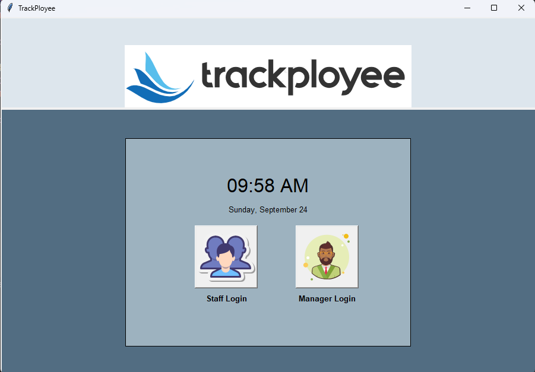

# Trackployee

## Project Overview

Trackployee is a desktop software solution designed to assist companies in efficiently managing their employee attendance tracking, and payroll generation.

## Key Features

Trackployee offers a range of essential features to streamline employee management:

### Secure Staff Login

- **Username/Password**: Employees can log in using traditional username and password credentials for authentication.
- **Biometric Authentication**: Robust biometric authentication methods, including fingerprint and facial recognition, enhance security and streamline the login process.

### Manager Dashboard

- **Comprehensive Staff Overview**: A dedicated manager dashboard provides a holistic view of all staff members, including their attendance details and work schedules.

### Automated Payslip Generation

- **Effortless Payroll Processing**: Trackployee simplifies payroll processing by automatically generating payslips for each staff member.
- **Email Delivery**: Payslips are conveniently delivered to employees via email for easy access and record-keeping.

## Technical Details

Trackployee is built using industry-standard technologies to ensure reliability and scalability:

- **Graphical User Interface (GUI)**: The user interface is developed using the Tkinter library, providing a responsive and user-friendly experience.

- **Data Management**: While the current implementation uses a JSON file to store staff data, there are plans to migrate to a robust database system for improved data management and scalability.

## Future Improvements

The project has a roadmap for future enhancements, including database integration for efficient data storage and retrieval. Continuous development and maintenance will ensure that Trackployee remains a valuable tool for companies seeking to optimize their employee management processes.

